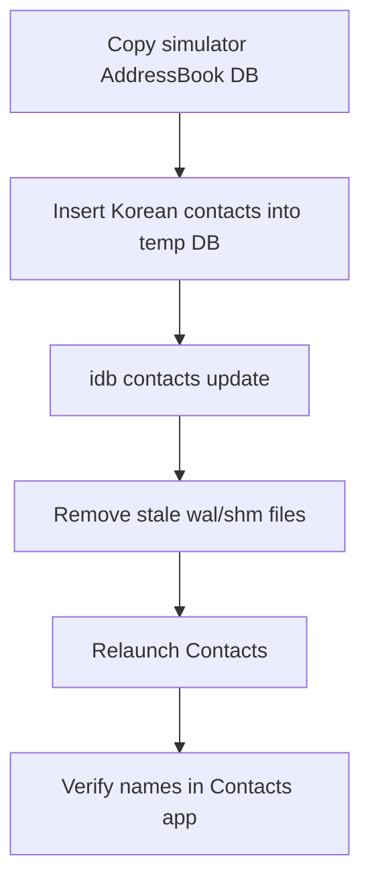

# Skill: korean-test-contacts

Create Korean simulator test contacts for WhoCallMe using the simulator Contacts database and `idb contacts update`.

## When to use

Use this skill when you need realistic Korean contacts to test:
- contact conversion
- 초성 search indexing
- incoming-call image generation
- restore / clear-photo flows
- mixed organization / department / title rendering

Do **not** use the Contacts app UI for Korean text entry through `idb ui text`.
`idb ui text` cannot reliably type Hangul. Use the DB import path below.

## Supported workflow

1. Copy the current simulator AddressBook databases to a temp directory.
2. Inject Korean contacts into the copied `AddressBook.sqlitedb`.
3. Import that directory with `idb contacts update`.
4. Remove stale `-wal` / `-shm` journal files.
5. Relaunch Contacts and verify the imported rows.

## Mermaid overview



## Default test set

The bundled script creates these contacts:
- 김민수 — 네이버 / 플랫폼 / iOS 개발자 / 010-1234-5678
- 이서연 — 카카오 / 디자인 / 프로덕트 디자이너 / 010-2345-6789
- 박지훈 — 쿠팡 / 커머스 / 백엔드 엔지니어 / 010-3456-7890
- 최유진 — 토스 / 성장 / 마케터 / 010-4567-8901
- 정하늘 — 라인 / AI / 리서처 / 010-5678-9012

These are good defaults for WhoCallMe because they exercise:
- common Korean family names
- Korean section headers in Contacts
- org / dept / title rendering
- phone-based conversion flows

## Prerequisites

- Simulator booted
- `idb` installed and working
- Contacts app can be closed and reopened
- Prefer the booted simulator, or pass an explicit UDID

## One-command usage

From the repo root:

```bash
python .claude/skills/korean-test-contacts/build_korean_contacts_db.py --udid <SIMULATOR_UDID> --output /tmp/whocallme-korean-contacts && idb contacts update --udid <SIMULATOR_UDID> /tmp/whocallme-korean-contacts && xcrun simctl terminate <SIMULATOR_UDID> com.apple.MobileAddressBook || true && rm -f "$HOME/Library/Developer/CoreSimulator/Devices/<SIMULATOR_UDID>/data/Library/AddressBook/AddressBook.sqlitedb-wal" "$HOME/Library/Developer/CoreSimulator/Devices/<SIMULATOR_UDID>/data/Library/AddressBook/AddressBook.sqlitedb-shm" "$HOME/Library/Developer/CoreSimulator/Devices/<SIMULATOR_UDID>/data/Library/AddressBook/AddressBookImages.sqlitedb-wal" "$HOME/Library/Developer/CoreSimulator/Devices/<SIMULATOR_UDID>/data/Library/AddressBook/AddressBookImages.sqlitedb-shm" && xcrun simctl launch <SIMULATOR_UDID> com.apple.MobileAddressBook
```

If using the booted simulator, replace `<SIMULATOR_UDID>` with `booted` for `simctl`, but keep the real UDID for the Python script and `idb`.

## Recommended step-by-step usage

### 1) Find simulator UDID

```bash
idb list-targets
```

### 2) Build temp contacts DB

```bash
python .claude/skills/korean-test-contacts/build_korean_contacts_db.py --udid 371BF853-7839-4FE1-98CA-D2FA159F19D5 --output /tmp/whocallme-korean-contacts
```

### 3) Import with idb

```bash
idb contacts update --udid 371BF853-7839-4FE1-98CA-D2FA159F19D5 /tmp/whocallme-korean-contacts
```

### 4) Clear stale journals

```bash
xcrun simctl terminate 371BF853-7839-4FE1-98CA-D2FA159F19D5 com.apple.MobileAddressBook || true
rm -f "$HOME/Library/Developer/CoreSimulator/Devices/371BF853-7839-4FE1-98CA-D2FA159F19D5/data/Library/AddressBook/AddressBook.sqlitedb-wal"
rm -f "$HOME/Library/Developer/CoreSimulator/Devices/371BF853-7839-4FE1-98CA-D2FA159F19D5/data/Library/AddressBook/AddressBook.sqlitedb-shm"
rm -f "$HOME/Library/Developer/CoreSimulator/Devices/371BF853-7839-4FE1-98CA-D2FA159F19D5/data/Library/AddressBook/AddressBookImages.sqlitedb-wal"
rm -f "$HOME/Library/Developer/CoreSimulator/Devices/371BF853-7839-4FE1-98CA-D2FA159F19D5/data/Library/AddressBook/AddressBookImages.sqlitedb-shm"
```

### 5) Relaunch and verify

```bash
xcrun simctl launch 371BF853-7839-4FE1-98CA-D2FA159F19D5 com.apple.MobileAddressBook
sqlite3 "$HOME/Library/Developer/CoreSimulator/Devices/371BF853-7839-4FE1-98CA-D2FA159F19D5/data/Library/AddressBook/AddressBook.sqlitedb" "select Last || First as name, Organization, Department, JobTitle from ABPerson where Last in ('김','이','박','최','정') order by ROWID;"
```

## Why journal cleanup matters

After `idb contacts update`, the base sqlite file may be correct but stale `-wal` / `-shm` files can cause Contacts to still show old data.

If imported contacts do not appear:
- terminate Contacts
- remove `AddressBook.sqlitedb-wal`
- remove `AddressBook.sqlitedb-shm`
- remove matching image DB journals
- relaunch Contacts

## Safety notes

- This workflow modifies only simulator contacts, not a physical device.
- The script copies the current AddressBook DB first, so built-in sample contacts are preserved.
- Re-running the script is idempotent for the bundled default set; existing matching name + phone entries are skipped.

## Reset options

- Erase simulator for a full reset
- Or restore from a fresh copied AddressBook DB without injected rows

## Validation checklist

- Contacts app shows Korean section headers like `ㄱ`, `ㅂ`, `ㅇ`, `ㅈ`, `ㅊ`
- Imported names are visible in the list
- Detail view shows company / department / title
- WhoCallMe can convert, preview, restore, and clear against these contacts
