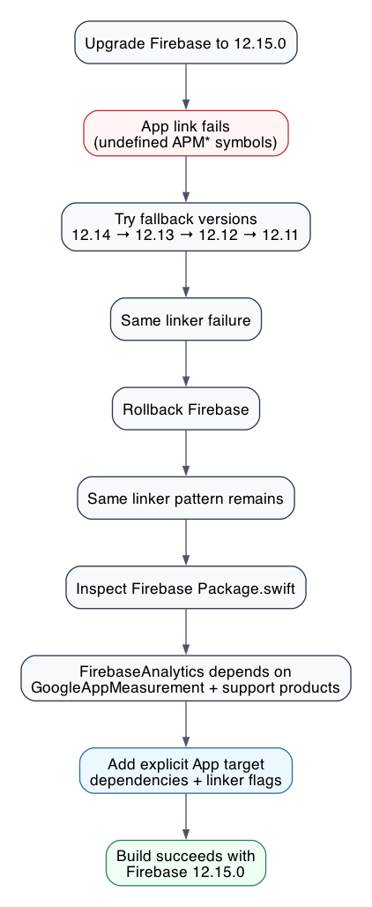

# Fixing FirebaseAnalytics Linker Failures After a Firebase Upgrade

## Problem

After upgrading Firebase iOS SDK, the app failed at link time with errors like:

```text
Undefined symbols for architecture arm64:
  "_APMAnalyticsConfiguration"
  "_APMAppMeasurementOriginFirebase"
  "_OBJC_CLASS_$_APMAnalytics"
  "_OBJC_CLASS_$_APMMeasurement"
```

The failure happened while linking the `App` target, even though Firebase packages were declared in the `DynamicThirdParty` framework.

## Why it failed suddenly

The first suspicion was that Firebase `12.15.0` introduced a breaking linker change. That was not the full story.

After rolling Firebase back, the same linker failure still reproduced on `main`. That meant the initial failure was not enough evidence to blame Firebase `12.15.0` itself.

The important project detail was that the app linked Firebase through a `DynamicThirdParty` wrapper using runtime-style package dependencies. That structure left the final `App` link step without all binary and support products that `FirebaseAnalytics` needs.

The symptom was a classic transitive binary dependency problem. `FirebaseAnalytics` references `APM*` symbols, which are implemented by GoogleAppMeasurement. If GoogleAppMeasurement is not linked into the final app link command, the app fails with undefined `APM*` symbols.

## What Firebase changed

Firebase did not remove those symbols. The relevant Firebase packaging shape is:

```swift
.library(
  name: "FirebaseAnalytics",
  targets: ["FirebaseAnalyticsTarget"]
)

.target(
  name: "FirebaseAnalyticsWrapper",
  dependencies: [
    .target(name: "FirebaseAnalytics"),
    .product(name: "GoogleAppMeasurement", package: "GoogleAppMeasurement"),
    "FirebaseCore",
    "FirebaseInstallations",
    .product(name: "GULAppDelegateSwizzler", package: "GoogleUtilities"),
    .product(name: "GULMethodSwizzler", package: "GoogleUtilities"),
    .product(name: "GULNSData", package: "GoogleUtilities"),
    .product(name: "GULNetwork", package: "GoogleUtilities"),
    .product(name: "nanopb", package: "nanopb"),
  ]
)
```

GoogleAppMeasurement itself is distributed as binary targets wrapped by package products:

```swift
.library(
  name: "GoogleAppMeasurement",
  targets: ["GoogleAppMeasurementTarget"]
)

.binaryTarget(
  name: "GoogleAppMeasurement",
  url: "https://dl.google.com/firebase/ios/swiftpm/12.15.0/GoogleAppMeasurement.zip",
  checksum: "..."
)

.binaryTarget(
  name: "GoogleAppMeasurementIdentitySupport",
  url: "https://dl.google.com/firebase/ios/swiftpm/12.15.0/GoogleAppMeasurementIdentitySupport.zip",
  checksum: "..."
)
```

This wrapper/binary-target structure was already present in Firebase `12.10.0`. So the sudden failure was not because Firebase `12.15.0` changed `FirebaseAnalytics` from source to binary or renamed the `APM*` symbols.

The notable Firebase-side change in `12.15.0` is that Firebase's package now requires `swift-tools-version: 6.1`. There were also Analytics, App Check, Crashlytics, Performance, Firestore, Remote Config, and AI updates between `12.10.0` and `12.15.0`, but the linker failure pattern came from missing transitive link products, not an Analytics API migration.

In short:

- Firebase still expects GoogleAppMeasurement to provide the `APM*` symbols.
- GoogleAppMeasurement is still packaged as binary frameworks.
- The app's generated link graph did not carry those binary frameworks through from the wrapper target to the final app link.
- Explicitly linking the required products at the app target fixed the problem.

## Root cause

`FirebaseAnalytics` depends on GoogleAppMeasurement and related support libraries.

In this project, linking Firebase only through the dynamic wrapper target was not enough for the final app link step. The app target also needed explicit package linkage for FirebaseAnalytics' transitive dependencies.

The investigation path was:



1. Upgrade Firebase to `12.15.0`.
2. App link fails with undefined `APM*` symbols.
3. Try Firebase `12.14`, `12.13`, `12.12`, and `12.11`.
4. The same linker failure appears.
5. Roll Firebase back and observe the same linker pattern.
6. Inspect Firebase `Package.swift`.
7. Confirm `FirebaseAnalytics` depends on GoogleAppMeasurement and support products.
8. Add explicit app target dependencies and linker flags.
9. Build succeeds with latest Firebase `12.15.0`.

## Fix

Add Firebase and GoogleAppMeasurement packages to the app target:

```swift
packages: [
    .remote(url: "https://github.com/2sem/GADManager",
            requirement: .upToNextMajor(from: "1.3.8")),
    .package(id: "firebase.firebase-ios-sdk", from: "12.15.0"),
    .package(id: "google.googleappmeasurement", from: "12.15.0"),
]
```

Then add the products to the app target dependencies:

```swift
dependencies: [
    .Projects.ThirdParty,
    .Projects.DynamicThirdParty,
    .package(product: "GADManager", type: .runtime),
    .package(product: "FirebaseCore"),
    .package(product: "FirebaseCrashlytics"),
    .package(product: "FirebaseAnalytics"),
    .package(product: "GoogleAppMeasurement"),
    .package(product: "GoogleAppMeasurementCore"),
    .package(product: "GoogleAppMeasurementIdentitySupport"),
    .package(product: "FirebaseInstallations"),
    .package(product: "GULAppDelegateSwizzler"),
    .package(product: "GULMethodSwizzler"),
    .package(product: "GULNSData"),
    .package(product: "GULNetwork"),
    .package(product: "nanopb")
]
```

Finally, add explicit linker flags for the binary GoogleAppMeasurement frameworks:

```swift
settings: .settings(base: [
    "OTHER_LDFLAGS": "$(inherited) -framework GoogleAppMeasurement -framework GoogleAppMeasurementIdentitySupport"
])
```

## Verification

Regenerate and build:

```bash
mise x -- tuist clean
mise x -- tuist install
mise x -- tuist generate --no-open
xcodebuild -workspace WhoCallMe.xcworkspace \
  -scheme App \
  -configuration Debug \
  -destination 'generic/platform=iOS Simulator' \
  build
```

Expected result:

```text
Build succeeded
```

## Notes

Firebase `12.15.0` was tried first, then fallback versions down to `12.11.0`. All failed with the same linker pattern, which confirmed the issue was not the Firebase release itself but missing explicit link dependencies.

Once the missing FirebaseAnalytics / GoogleAppMeasurement linkage was added, the latest Firebase `12.15.0` built successfully.
